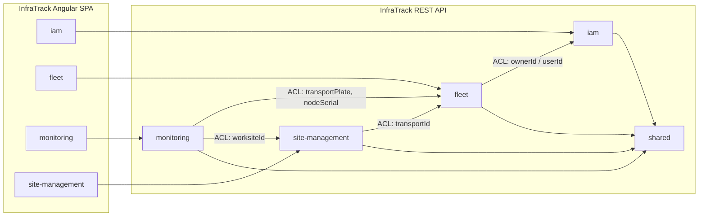

# InfraTrack Backend — Guía de Bounded Contexts (DDD)

> **Nota:** documento de trabajo para alinear backend y frontend. Puedes eliminarlo cuando ya no lo necesites.

Esta guía replica la estructura del proyecto de referencia del profesor (`learning-center-platform`) y la conecta con los bounded contexts del frontend Angular (`InfraTrack-Frontend`).

## Estructura base por contexto

Cada bounded context vive bajo:

```text
com.techtitans.infratrack.platform.<context>/
├── domain/
│   ├── model/
│   │   ├── aggregates/      # Raíces de agregado (User, FleetTransport, Worksite, Alert…)
│   │   ├── entities/        # Entidades internas del agregado
│   │   ├── valueobjects/    # Objetos de valor (Roles, PlateNumber, GeoCoordinate…)
│   │   ├── commands/        # Intenciones de escritura (CreateTransportCommand…)
│   │   ├── queries/         # Intenciones de lectura (GetTransportByIdQuery…)
│   │   └── events/          # Eventos de dominio / integración
│   ├── exceptions/          # Excepciones específicas del contexto
│   └── repositories/        # Puertos de persistencia (interfaces)
├── application/
│   ├── commandservices/     # Contratos de servicios de comando
│   ├── queryservices/       # Contratos de servicios de consulta
│   └── internal/
│       ├── commandservices/ # Implementaciones @Service
│       ├── queryservices/  # Implementaciones @Service
│       ├── eventhandlers/   # Reacción a eventos Spring / dominio
│       └── outboundservices/# Puertos hacia infra externa (tokens, ACL…)
├── infrastructure/
│   ├── persistence/jpa/     # entities, repositories, adapters, assemblers
│   ├── authorization/       # (solo iam) Spring Security + JWT
│   ├── hashing/             # (solo iam) BCrypt
│   └── tokens/              # (solo iam) JWT
└── interfaces/
    ├── rest/
    │   ├── resources/       # DTOs JSON de entrada/salida
    │   └── transform/       # Assemblers Resource ↔ Command/Entity
    └── acl/                 # Fachadas anti-corrupción hacia otros contextos
```

## Contexto compartido (`shared`)

Cross-cutting igual que en el proyecto del profesor:

```text
com.techtitans.infratrack.platform.shared/
├── domain/model/aggregates/AbstractDomainAggregateRoot.java
├── application/result/Result.java, ApplicationError.java
├── infrastructure/
│   ├── persistence/jpa/…
│   ├── documentation/openapi/configuration/
│   └── i18n/configuration/
└── interfaces/rest/
    ├── GlobalExceptionHandler.java
    ├── resources/ErrorResource.java, MessageResource.java
    └── transform/ResponseEntityAssembler.java, ErrorResponseAssembler.java
```

## Mapa de bounded contexts

| Contexto | Responsabilidad (PDF + Frontend) | Rutas frontend | Endpoints REST (base `/api/v1`) | Estado |
|----------|----------------------------------|----------------|----------------------------------|--------|
| **iam** | Registro, login, roles, JWT | `/iam/*` | `/authentication/*`, `/users`, `/roles` | **Implementado** |
| **fleet** | IoT nodes, transportes, conductores, configuración owner | `/dispositivos`, `/transportes`, `/conductores`, `/configuration` | `/iotNodes`, `/machinery`, `/operators`, `/maintenanceRecords` | **Implementado** |
| **monitoring** | Panel, telemetría, alertas, reportes | `/control-panel`, `/operacion`, `/telemetry`, `/reports-analytics` | `/telemetryData`, `/alerts`, `/alerts/{id}/acknowledgements` | **Implementado** |
| **site-management** | Obras, personal, asignación de activos | `/obras/*` | `/worksites`, `/worksites/{id}/transports`, `/worksites/{id}/staff` | **Implementado** |
| **shared** | Errores, i18n, OpenAPI, base agregados | `/profile` (UI) | convenciones TS-ARCH* | **Implementado** |

## Relaciones entre contextos (Context Map)



## Orden de implementación recomendado

1. **iam** — autenticación y roles (`ROLE_OWNER`, `ROLE_ADMIN`, `ROLE_TECHNICIAN`).
2. **fleet** — activos y nodos IoT (base del dominio).
3. **site-management** — obras, personal y asignación de transportes (ACL → fleet).
4. **monitoring** — telemetría y alertas (ACL → fleet). KPIs/reportes pendientes.

## Convenciones API (igual que el profesor)

- Base path: `/api/v1`
- Errores: `{ "code", "message", "details?" }`
- JWT Bearer en endpoints protegidos
- Locales: `en` (default), `es` vía `Accept-Language`

## Entidades alineadas con el frontend

| Frontend entity | Contexto | Agregado backend propuesto |
|-----------------|----------|----------------------------|
| `User` | iam | `User` |
| `IotDevice` | fleet | `IotNode` |
| `FleetTransport` | fleet | `FleetTransport` |
| `FleetDriver` | fleet | `FleetOperator` |
| `Worksite` | site-management | `Worksite` |
| `DashboardAlert` | monitoring | `FleetAlert` |

## Próximo paso

Implementar **fleet** siguiendo el mismo patrón que `iam`: agregados, commands/queries, JPA adapters y controllers REST conectados a las rutas del `environment.development.ts` del frontend.
